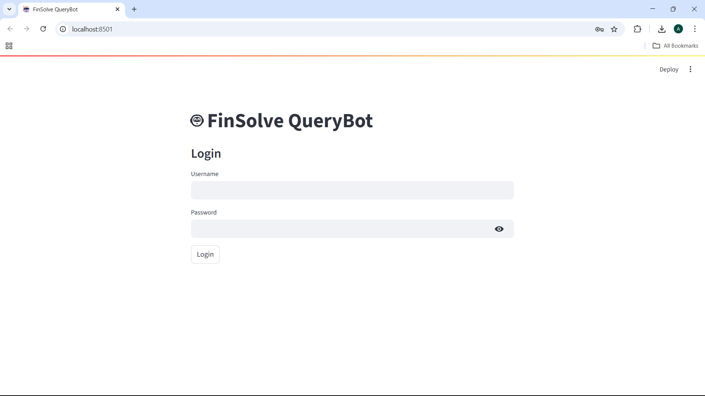

# 🤖 FinSolve QueryBot

A secure, role-aware chatbot for internal use at **FinSolve Technologies**. Built using FastAPI, Streamlit, and LangChain, the bot ensures users can only access data permitted by their role.

---

## Project Overview

This project implements a Retrieval Augmented Generation (RAG) based chatbot with Role-Based Access Control (RBAC) for FinSolve Technologies, a leading FinTech company. The system enables different departments to access role-specific information through a natural language interface, helping to reduce communication delays, address data access barriers, and offer secure, department-specific insights on demand.

---

## 📚 Table of Contents

- [🚀 Features](#-features)
- [🧠 Tech Stack](#-tech-stack)
- [🔐 Role Definitions](#-role-definitions)
- [⚙️ Setup Instructions](#️-setup-instructions)
- [📦 Project Structure](#-project-structure)
- [💬 Usage Example](#usage-example)
- [🏗️ Architectural Choices](#️-architectural-choices)
- [📄 Example Queries](#-example-queries)

---

## 🚀 Features

- Role-Based Access Control (RBAC) for document-level security
- Chat interface with context-aware answers
- Markdown & CSV document parsing
- Retrieval-Augmented Generation (RAG)
- Clean vector search using Chroma
- LLM integration via APi

---

## 🧠 Tech Stack

| Layer          | Technology         |
|----------------|--------------------|
| Backend API    | FastAPI            |
| Frontend UI    | Streamlit          |
| Vector DB      | ChromaDB           |
| Embeddings     | HuggingFace (BAAI/bge-small-en-v1.5) |
| LLM            | deepseek-r1-0528   |
| Prompt Engine  | LangChain          |
| Auth           | HTTP Basic Auth    |

---

## 🔐 Role Definitions

| Role       | Permissions                                  |
|------------|----------------------------------------------|
| `C_level`  | Access to all documents                      |
| `engineering` | Only engineering & general documents      |
| `finance`  | Only finance & general documents             |
| `hr`       | Only HR & general documents                  |
| `marketing`| Only marketing & general documents           |
| `employee` | Only general documents                       |

Role assignment is determined automatically based on file path patterns in Markdown/CSV documents.

---

## ⚙️ Setup Instructions

1. **Clone this repo**
   ```bash
   git clone https://github.com/abdulrahim860/RBAC-Chatbot.git
   cd RBAC-chatbot

2. **Create virtual environment**
   ```bash
   python -m venv rbac
   source rbac/bin/activate  # Linux/macOS
   rbac\Scripts\activate     # Windows

3. **Install dependencies**
   ```bash
   pip install -r requirements.txt

4. **Setup environment variables**
   ```bash
   OPENAI_API_KEY=your_openrouter_api_key
   OPENAI_API_BASE=https://openrouter.ai/api/v1

5. **Build the vectorstore**
   ```bash
    rbac\Scripts\python.exe -m app.utils.build_vectorstore

6. **Start the FastAPI backend**
   ```bash
   uvicorn app.main:app --reload

7. **Run the Streamlit frontend**
   ```bash
   streamlit run chatbot_ui.py

---

## 📦 Project Structure
```
RBAC-chatbot/
│
├── app/
│   ├── main.py                     # FastAPI entry point
|   ├── chatbot_ui.py               # Streamlit frontend interface
│   ├── services/
│   │   ├── auth.py                 # User authentication logic
│   │   └── chat.py                 # Chat endpoint using RAG
│   ├── schemas/
│   │   └── ChatRequest.py          # Request schema for chat input
│   └── utils/
│       ├── access_control.py       # Role-based file access logic
│       ├── rag.py                  # RAG core logic (prompt + retrieval)
│       ├── build_vectorstore.py    # Loads and chunks documents into ChromaDB
│       └── load_vectorstore.py     # Loads the saved vectorstore from disk
│
├── resources/
│   ├── data/                       # Markdown/CSV files for ingestion
|   └── vector_store/               # To store vector embeddings   
│
|
├── requirements.txt               # Python dependencies
├── .env                           # Environment variables (API keys etc.)
├── .pyproject.toml                # (optional) Poetry config or project metadata
├── .python-version                # Python version lock for version managers
└── README.md                      # Documentation
```
---

## 💬Usage Example

Here’s how the RBAC Chatbot works in action:



---

## 🏗️ Architectural Choices

This project follows a **modular, RBAC-aware Retrieval-Augmented Generation (RAG)** architecture:

| Layer                 | Description                                                                 |
|----------------------|-----------------------------------------------------------------------------|
| `Streamlit UI`        | Lightweight frontend for authentication and chatting with the assistant    |
| `FastAPI Backend`     | Handles user auth, role-aware chat endpoint, and query routing             |
| `Chroma Vector Store` | Embeds and stores chunked documents with HuggingFace embeddings            |
| `DeepSeek API`        | Used as the LLM backend to generate accurate, contextual responses         |
| `Role-Based Access`   | Custom `assign_roles()` logic injects role filters into metadata at chunking |
| `.env` + Secrets      | DeepSeek API keys and sensitive config are managed via `.env` files        |

📁 Documents are split, embedded, and stored only once via `build_vectorstore.py`. Chat responses are filtered **at retrieval time** using the role metadata for security and privacy.

---

## 📄 Example Queries
| Query                          | Role          | Result Behavior                      |
| ------------------------------ | ------------- | ------------------------------------ |
| "What is our Q2 revenue?"      | `finance`     | Extracts the financial data          |
| "Hiring plan for Q3?"          | `hr`          | Fetches only HR CSV sources          |
| "What's our API architecture?" | `engineering` | Shows relevant engineering docs      |
| "Show marketing KPIs"          | `marketing`   | Displays only marketing data         |
| "All team plans for Q2"        | `employee`    | Access denied or filtered summary    |
| "Who is our cloud provider"    | `C_level`     | Access all department data           |

---
